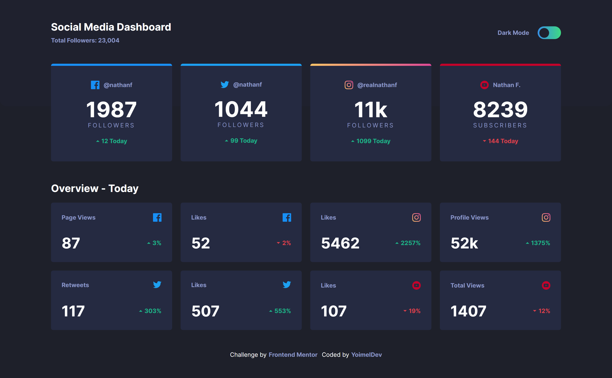
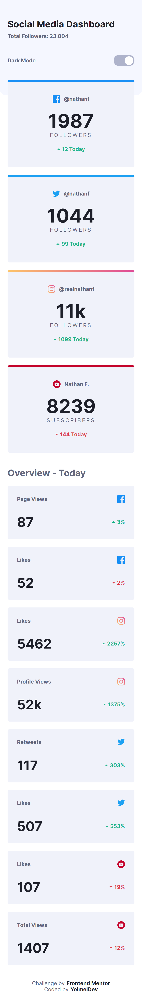

# Frontend Mentor - Social media dashboard with theme switcher

## ✍🏻 Description

[Social media dashboard with theme switcher challenge on Frontend Mentor](https://www.frontendmentor.io/challenges/social-media-dashboard-with-theme-switcher-6oY8ozp_H), where i put into practice my skills, trying to make it as close as possible to the design provided.

## 🎨 Preview

You can see the result here → [Social media dashboard with theme switcher](https://yoimeldev.github.io/Social-media-dashboard/)

    
🖥️ Desktop version

    
📱 Mobile version

## :computer: Technologies

- Gulp
- Sass
- Js
- Mobile-first workflow
